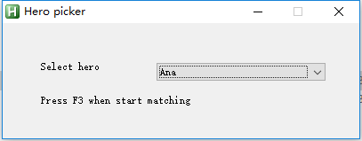

# heropicker
Automatic pick hero in overwatch

## How it work

This program is written with ahk script. So it only does some simulate mouse click and some screen recognition. I have played overwatch with it for a week and everything works fine.

## DEMO

## How to use 

- download exe file from [here](https://github.com/ufo22940268/heropicker/releases)
- execute `pickhero.exe` and select the hero you want this tool to pick
- launch overwatch and set display mode to borderless windowed mode in display settings
- start matching in overwatch
- press <kbd>F3</kbd>
- when game start, it will automatically pick hero for you.
- script will stop when hero is selected. And you can press <kbd>F3</kbd> any time to stop script.

## TODO

- [ ] only support 1920x1080 resolution.

